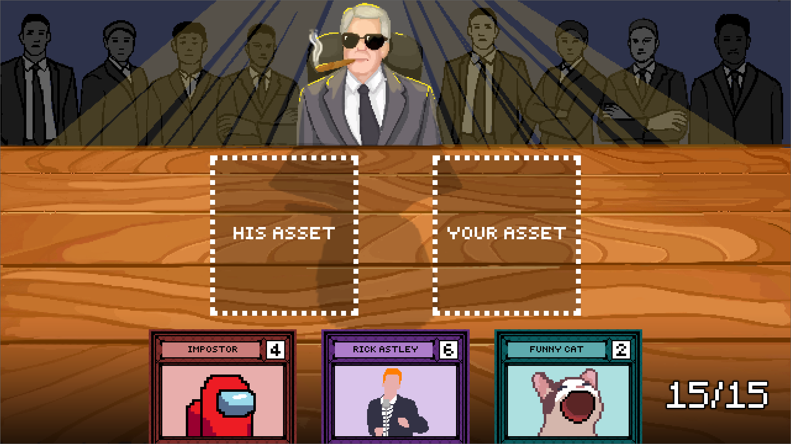

## Serious Business

### **Play the game in your browser here: https://breakbar.itch.io/serious-business**

You are about to close the deal of a lifetime with the CEO of jokes. However, he is not easily impressed, and to convince him, you have to show him your best joke assets. Defeat him by playing cards, and countering the ones he plays.

Every card has a strength value and a unique ability. Both of you play a card (alternating with who plays it first) and the difference between the strength of the two cards is dealt as damage. The damage dealt can be further altered by the abilities.

This game was made by a team of three for the Global Game Jam 2024, which had the theme "Make me laugh". This was our first game jam, as well as our first game, so we kept it very simple. Nevertheless, while we had 48 hours to make the game, we spent half of it trying to learn how to use the Godot engine.
